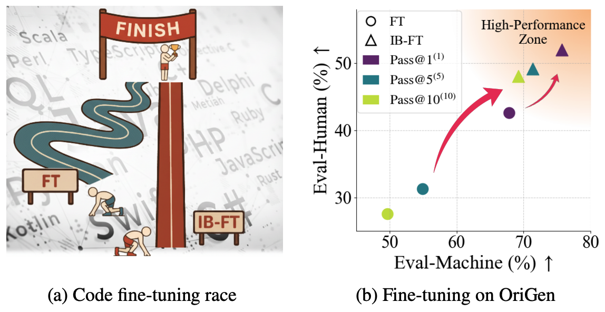

<div align='center'>


# Breaking Memorization Barriers in LLM Code Fine-Tuning via Information Bottleneck for Improved Generalization

[]()
[](https://arxiv.org/abs/2510.16022)
[](https://huggingface.co/collections/OPTML-Group/memorization-barrier)
[](https://github.com/OPTML-Group/MemorizationBarrier/issues)

[](https://github.com/OPTML-Group/MemorizationBarrier?tab=MIT-1-ov-file)
[](https://github.com/OPTML-Group/MemorizationBarrier)
[](https://github.com/OPTML-Group/MemorizationBarrier)
[](https://github.com/OPTML-Group/MemorizationBarrier)

</div>

<table align="center">
  <tr>
    <td align="center"> 
       
      <br>
      <em style="font-size: 18px;">
        <strong style="font-size: 18px;">Figure 1:</strong>
        Overview and key results of our Information Bottleneck–based code fine-tuning framework.
      </em>
    </td>
  </tr>
</table>


Official repository for
[Breaking Memorization Barriers in LLM Code Fine-Tuning via Information Bottleneck for Improved Generalization](https://arxiv.org/abs/2510.16022).


## Abstract

Adapting pretrained large language models (LLMs) to code domains via supervised fine-tuning (FT) has been commonly used for code generation. However, we identify a previously underappreciated failure mode, the memorization barrier, where strong memorization of downstream code data in the base model could trap optimization and prevent the standard FT from effectively acquiring new, generalizable code knowledge. To overcome this barrier, we propose the information bottleneck (IB)-guided fine-tuning, termed IB-FT, which applies an IB penalty on hidden representations of the code data to compress spurious, memorized features while preserving task-relevant information. Extensive experiments on two code benchmarks (OriGen and Evol-CodeAlpaca-V1) show that IB-FT substantially alleviates the memorization barrier, improves top-1 performance (Pass@1), and yields far more stable gains under the stricter multi-sample metric Pass@k(m) (a problem counts as solved only if at least m of k samples pass unit tests) compared with conventional FT.

## Getting Started

### Installation

You can install the required dependencies using the following command:

```
pip install -r requirements.txt
```

### Training IB-FT

```
export WANDB_API_KEY=XXX
export HUGGINGFACE_TOKEN=XXX

torchrun --nproc_per_node 1  train_ib.py \
    --base_model="deepseek-ai/deepseek-coder-7b-instruct-v1.5"\
    --training_config="./config/training_args.json"\
    --adapter_config="./config/adapter_config.json"\
    --dataset="henryen/origen_dataset_instruction"\
    --use_deepspeed
```

## Download Models

To directly using our IB-based code model, please refer to our HuggingFace Collection:

* [🤗OPTML-Group](https://huggingface.co/collections/OPTML-Group/memorization-barrier)


## Contributors

* [Changsheng Wang](https://changshengwang.me/)
* [Xin Chen](https://xinchenhawaii.github.io/)

## Cite This Work

```
@article{wang2025breaking,
  title={Breaking Memorization Barriers in LLM Code Fine-Tuning via Information Bottleneck for Improved Generalization},
  author={Wang, Changsheng and Chen, Xin and Liu, Sijia and Ding, Ke},
  journal={arXiv preprint arXiv:2510.16022},
  year={2025}
}
```
